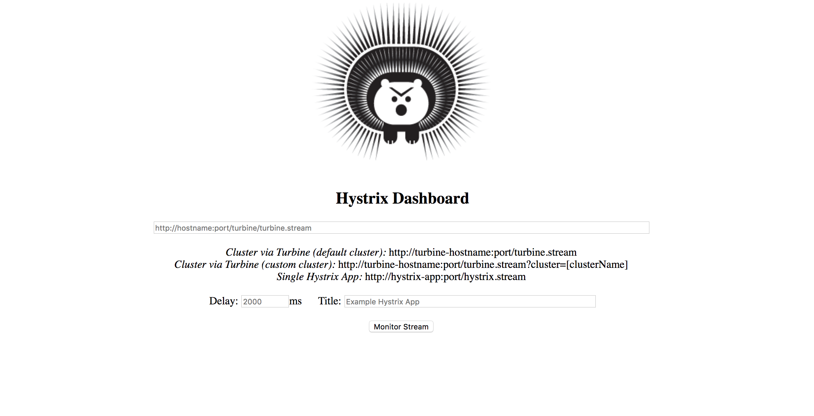
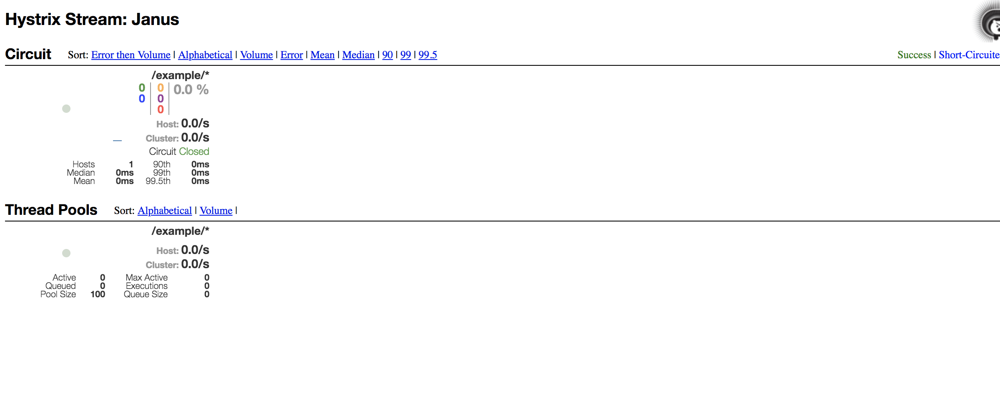

# Janus - Circuit Breaker Example

Janus has a circuit breaker plugin that can be configured on each endpoint. To test this example start by running:

```sh
docker-compose up -d
```

You can access the [hystrix](https://github.com/Netflix/Hystrix) dashboard on http://localhost9002/hystrix



On the URL field please add http://janus:8081/hystrix which is the streaming endpoint in Janus. This endpoint will start streaming metrics about your circuits.

Now you can start making request to `/example`

```sh
curl localhost:8080/example
```

If you take a look on the dashboard you should see something like this:



## Simulating failure

To simulate failure run:

```sh
docker-compose stop service1
```

This will force your proxy to go down and Janus won't be able to reach it.

Start making a lot of requests to `/example` and see what's going to happen on the dashboard.

For all the options on how to configure this plugin please visit the [documentation](https://hellofresh.gitbooks.io/janus/plugins/cb.html) page.
